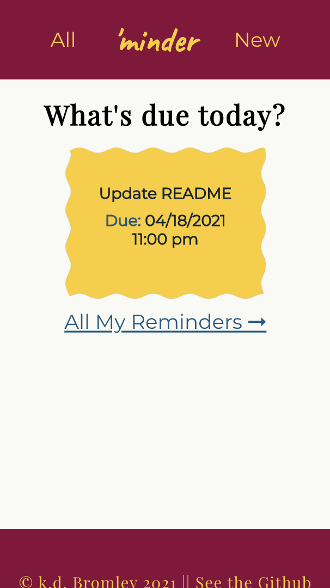
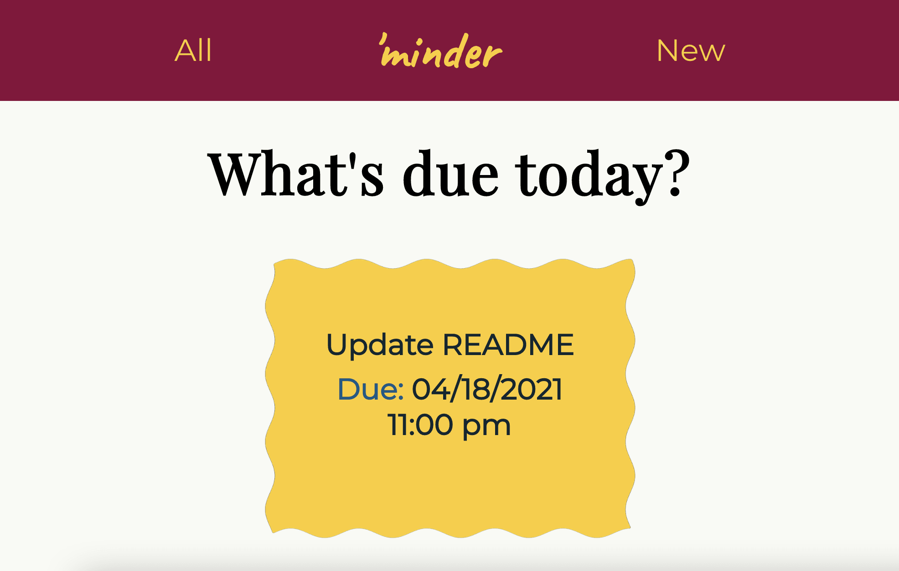
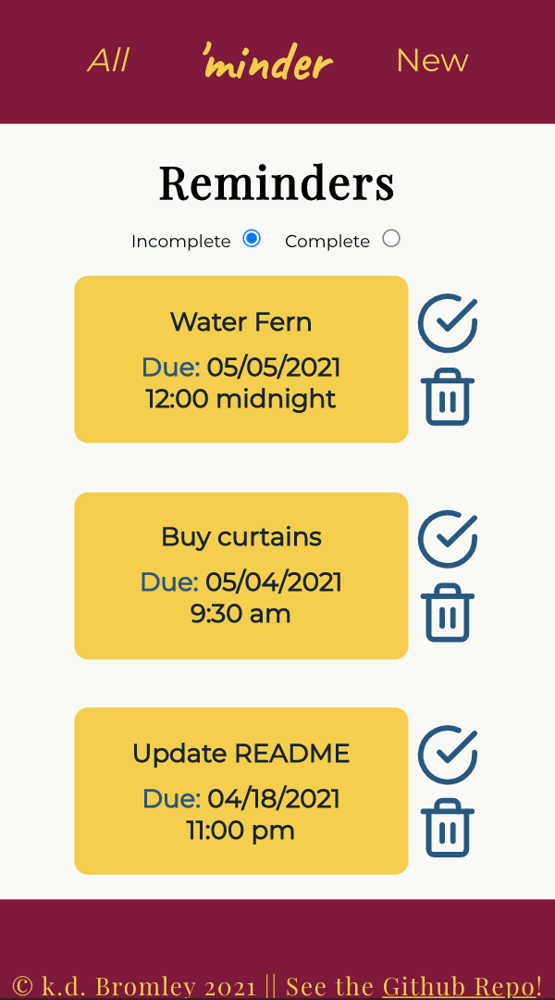
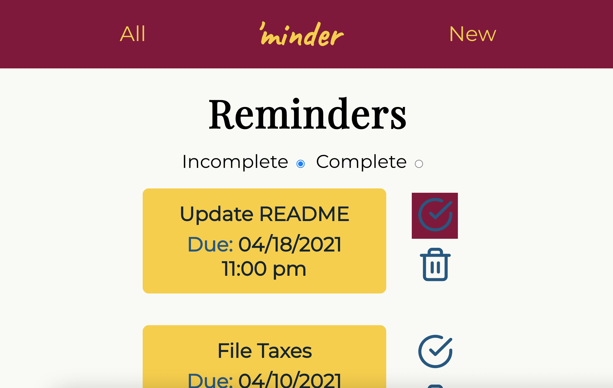
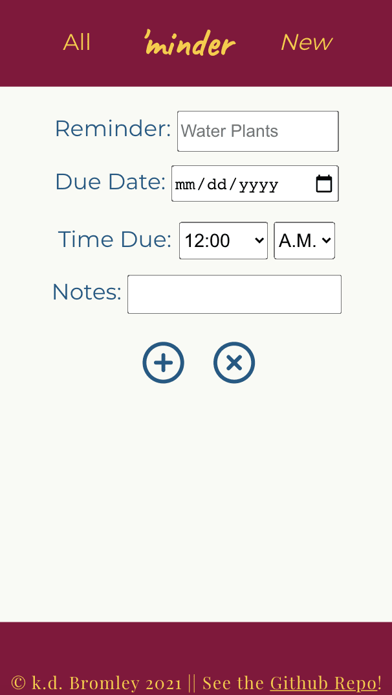
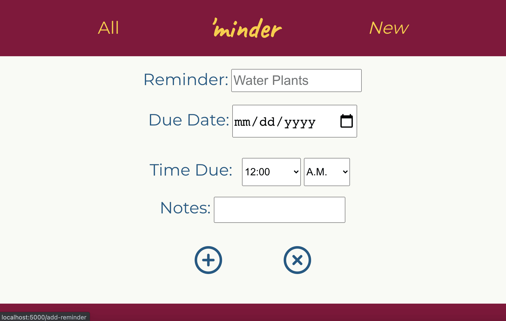
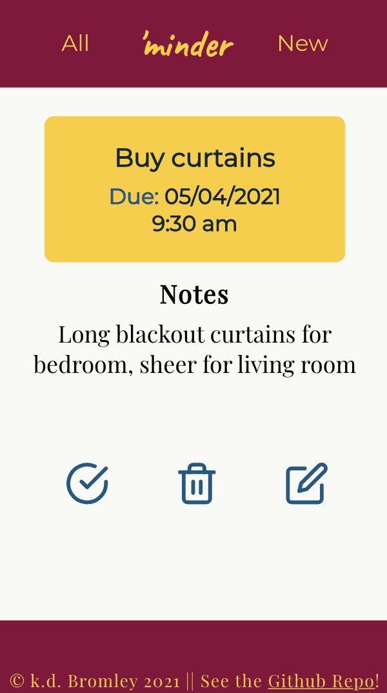
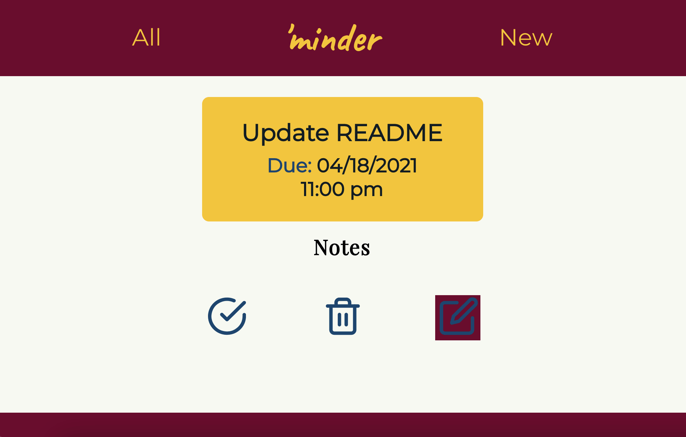
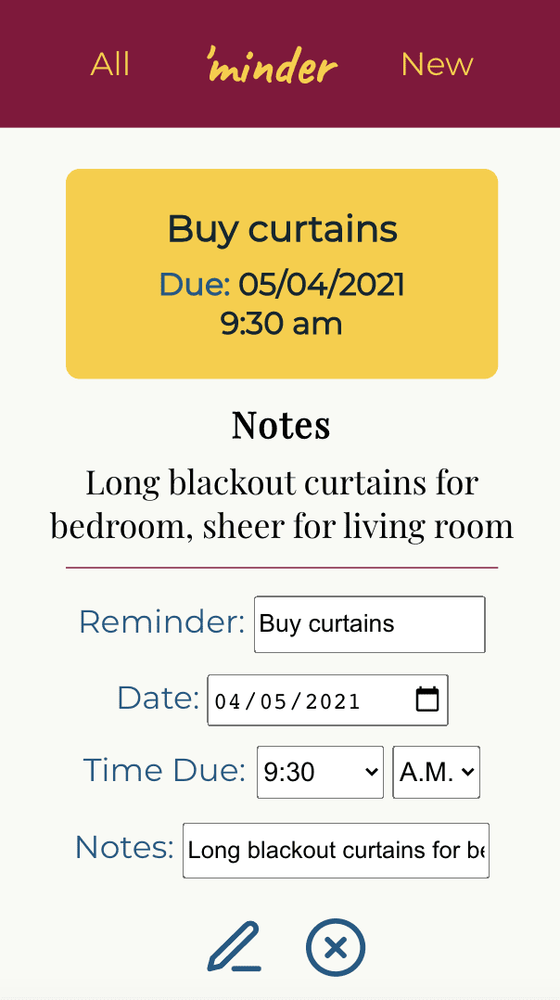
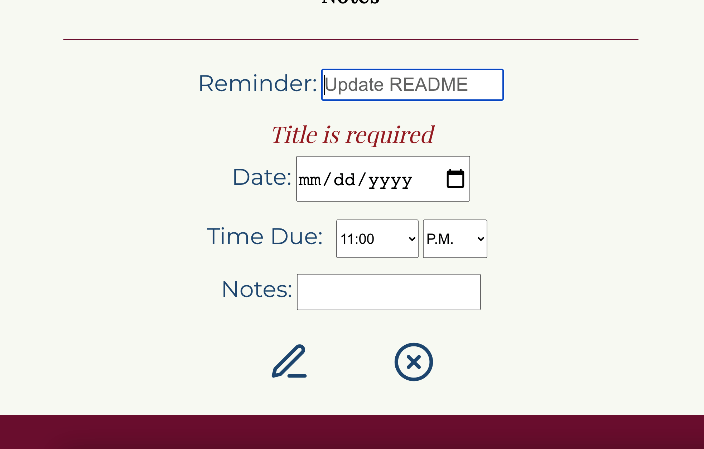

# 'minder App
First fullstack capstone for my Software Engineering program at Thinkful. 
A simple reminders application to demonstrate:
* ability to build a REST API consisting of an Express server and PostgreSQL database
* ability to build a client-side React app to interact with the API
* ability to produce a functional, responsive fullstack application with thoughtful UX/UI design and accessibility built-in.

The live app can be found at https://minder-app.vercel.app/

This repo is also intended as a demonstation of my skills in using Git/version control as well as issue tracking.

## Summary and Use
The app supports basic use as a reminder keeper - you can view, add and delete, edit, and check/uncheck reminders. 

The app currently only functions with a single default 'dummy user' to demonstrate functionality. Authorization and user accounts are future features. Various security measures have been put in place, including using Helmet.js and santitizing server-side to prevent XSS attacks.

###### Home Page

###### All Reminders List

###### New Reminder Form

###### Individual Reminder Page

###### Edit Reminder

## Tools
This front end application was made using
* React framework
* JSX
* Javascript
* HTML
* CSS (vanilla)

The backend (https://github.com/kdbromley/minder-app-api) consists of an Express server and Heroku PostgreSQL database.

This project was bootstrapped with [Create React App](https://github.com/facebook/create-react-app).
